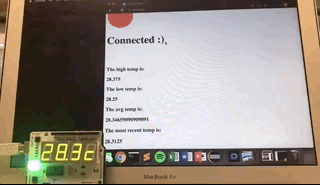
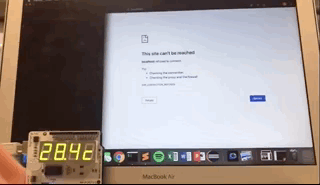
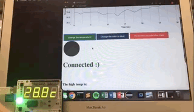

# Arduino-Browser Interaction Project

This project created a serial connection between an Arduino (Board Model: UNO R3) and
a web browser. The Arduino has a temperature sensor, RGB light, and 7-segment display.

We implemented the following features:

* View the most recent, min, max and average temperatures on the browser
* View the temperature over time in a dynamic line graph on the browser
* See whether the temperature has gone up, down or stayed the same second-over-second
via a dynamically colored dot on the browser
* Send a signal from browser to Arduino to change the temperature from C to F, or from F to C
* Send a signal from browser to Arduino to turn the light blue
* Send a signal from browser to Arduino to put the Arduino into Standby mode (or take the Arduino out of standby mode)
* Wait for Arduino to be reconnected if it has been disconnected
* Press 'q' in the terminal to quit the program

This was a final project for CIT595 (Computer Systems Programming) at UPenn. Code for the project is available upon request (unless you're a current 595 student!!)

## Getting Started

These instructions will get you a copy of the project up and running on your local machine for development and testing purposes.

### Prerequisites

You will need the following software and hardware to run this project:

```
Arduino (Board Model: UNO R3)
```
```
Arduino IDE
```
```
C
```
```
HTML
```
```
JavaScript
```

### Installing

In order to run this project, you will, of course, need an Arduino - they are relatively cheap online! This project assumes you have a Mac or Linux machine.

Then you will need to install the Arduino IDE. Go [here](https://www.arduino.cc/en/Main/Software) and follow the "Download the Arduino IDE" instructions for your platform.

Finally, you will need a C compiler.

Once everything is installed, download the code. Place all files in the same directory.

Connect your Arduino board to your Mac/Linux machine and launch the Arduino development environment. The first time you start Arduino, it may ask you to create a directory for your "sketches" (Arduino programs). Specify a directory (create a new one if need be) and then click OK.

Go to:
```
Tools > Board
```
And select “Arduino/Genuino Uno”. Then go to:
```
Tools > Port
```
And select the device file for your computer. On Linux it should be something like “/dev/ttyUSB10” and on Mac it should be something like “/dev/cu.usbmodem1411”.

Using the Arduino development environment, open ```temperature.ino``` (it may ask you to create a new folder for it), click the ```Verify``` button (check mark icon). Last, click the ```Upload``` button (right arrow icon). The program is now loaded onto your Arduino!

Once this is done, navigate to your code directory and compile server.c; for example:
```
clang -o server server.c
```

Finally, find the device file for your computer. From the root directory in your terminal, run ```cd /dev```, then ```ls```. On Linux it should be something like “/dev/ttyUSB10” and on Mac it should be something like “/dev/cu.usbmodem1411”.

Now you can run the program! Run the following command in your terminal:
```
./server 3000 /dev/[device_file]
```

Navigate to ```localhost:3000```!

## Features

Demonstrations of the features mentioned above:

* View the most recent, min, max and average temperatures on the browser
<br/>
* View the temperature over time in a dynamic line graph on the browser
* See whether the temperature has gone up, down or stayed the same second-over-second
via a dynamically colored dot on the browser<br/>

* Send a signal from browser to Arduino to change the temperature from C to F, or from F to C<br/>

* Send a signal from browser to Arduino to turn the light blue<br/>

* Send a signal from browser to Arduino to put the Arduino into Standby mode (or take the Arduino out of standby mode)<br/>

* Wait for Arduino to be reconnected if it has been disconnected<br/>


## Versions

We used the following software versions:

* Arduino 1.8.8
* HTML5
* JavaScript 9.0

## Authors

* **Shruti Sinha** - *Arduino &amp; Server* - [GitHub](https://github.com/shruti0085)
* **Tina Huang** - *Server* - [GitHub](https://github.com/tinawh)
* **Naomi Pohl** - *Frontend &amp; Server* - [GitHub](https://github.com/naomipohl)

## License

This project is licensed under the MIT License.

## Acknowledgments

* Professor [Chris Murphy](http://www.cis.upenn.edu/~cdmurphy/)
* Joel Krim, TA
* Brandon Tineo, TA
